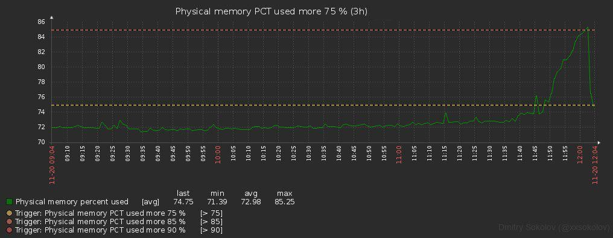

# zabbix-telegram-notify

A Zabbix alertscript that delivers notifications to Telegram. One file, no
service, no database: Zabbix runs it once per alert and it exits.

A fork of [xxsokolov/Zabbix-Notification-Telegram][upstream] (MIT), archived in
2023. Its successor was abandoned the same year wanting FastAPI, PostgreSQL and
Selenium for features nobody here uses, so this stays what the original was: a
script.

[upstream]: https://github.com/xxsokolov/Zabbix-Notification-Telegram

## Requires

| | |
|---|---|
| Zabbix | **7.0**. `mediatypes.yaml` is a 7.0 export and will not import into an older server; the frontend link templates in the config follow 7.0's URL scheme. On 6.x, create the media type by hand and expect to adjust those links. |
| Python | 3.6 or newer, whichever `/usr/bin/python3` is — that path is the script's shebang. |
| Packages | Pinned in `.requirements`: `pyTelegramBotAPI`, `xmltodict`; `pysocks` is used only with a proxy. |

Paths below are the RHEL/Debian package defaults. Use whatever
`AlertScriptsPath` in `zabbix_server.conf` actually says, and substitute the
user Zabbix runs as for `zabbix:zabbix`.

## Install

```sh
# 1. the script, executable, plus its assets and the config schema
install -m 0755 zbxTelegram.py /usr/lib/zabbix/alertscripts/
install -m 0644 zbxTelegram.cfg.example /usr/lib/zabbix/alertscripts/
install -d -m 0755 /usr/lib/zabbix/alertscripts/zbxTelegram_files/classes
install -m 0644 zbxTelegram_files/test.png \
        zbxTelegram_files/error_send_photo.png \
        /usr/lib/zabbix/alertscripts/zbxTelegram_files/
install -m 0644 zbxTelegram_files/classes/argparser.py \
        /usr/lib/zabbix/alertscripts/zbxTelegram_files/classes/

# 2. the config, readable only by the Zabbix user
install -o root -g zabbix -m 0640 zbxTelegram.cfg.example \
        /usr/lib/zabbix/alertscripts/zbxTelegram.cfg

# 3. state the script writes: the log, and the chat-id cache
install -d -o zabbix -g zabbix -m 0750 /var/log/zbxTelegram
install -d -o zabbix -g zabbix -m 0750 /var/lib/zbxTelegram
install -m 0644 logrotate.zbxTelegram /etc/logrotate.d/zbxTelegram

# 4. dependencies, into the interpreter the shebang names
/usr/bin/python3 -m pip install -r .requirements
```

Both the `.cfg` and the `.cfg.example` belong beside the script: the example is
the schema the loader falls back to, so shipping only the `.cfg` turns a key you
omitted into a `NameError` mid-delivery. The loader says so in the log when the
example is missing.

**On Debian 12, Ubuntu 23.04+, Fedora 38+** step 4 fails with
`externally-managed-environment` (PEP 668). Use the distro packages where they
exist, or `--break-system-packages`. A virtualenv will not work unless you also
change the shebang, which is hardcoded to `/usr/bin/python3`.

**With SELinux enforcing**, label the two new state directories or the writes
are denied — the log falls back to stdout silently, and the cache failure costs
the notification:

```sh
semanage fcontext -a -t zabbix_var_lib_t '/var/lib/zbxTelegram(/.*)?'
semanage fcontext -a -t zabbix_log_t     '/var/log/zbxTelegram(/.*)?'
restorecon -Rv /var/lib/zbxTelegram /var/log/zbxTelegram
```

Check `ausearch -m avc -c python3` after the first alert.

### Telegram

Create a bot with [@BotFather](https://t.me/BotFather) and keep the token for
the next section. Then decide what goes in each user's media **Send to** field:

| Value | Works when |
|---|---|
| `123456789` or `-100123456789` | always — a numeric chat id needs nothing else, and is the only option with no preconditions |
| `@username` | the person has sent the bot at least one message |
| exact group title | the bot is in the group and someone has posted since |

The last two are resolved through Telegram's `getUpdates`, which only retains
updates for about 24 hours and only works if nothing else is consuming the same
bot's updates or has a webhook set on it. The resolved id is then cached in
`config_cache_file`. **Prefer numeric ids** unless you have a reason not to.

To find a chat id: add the bot, post a message, then open
`https://api.telegram.org/bot<token>/getUpdates`.

### Zabbix

Import `mediatypes.yaml`, or create a script media type pointing at
`zbxTelegram.py` with these five parameters, in this order:

```
{ALERT.SENDTO}
{ALERT.SUBJECT}
{ALERT.MESSAGE}
{$TG_TOKEN}
--zabbix-pass={$ZNT_ZABBIX_PASS}
```

The two macros must exist **before** the media type is used, or Zabbix passes
the literal `{$TG_TOKEN}` through and the script exits saying so. See
[Secrets](#secrets). `--quiet-hours=...` may be added as a further parameter to
give this media type its own window.

Each action's operation needs a custom message. The subject must contain
**exactly one** of `{Problem}`, `{Resolved}` or `{Update}` — that literal is how
the script tells the message type, and an operation left on Zabbix's default
message will always be delivered loudly. What the actions here send:

```
{Problem} {TRIGGER.SEVERITY} {{TRIGGER.SEVERITY}}: {EVENT.NAME}
{Resolved} {TRIGGER.SEVERITY} {{TRIGGER.SEVERITY}} {EVENT.NAME}
{Update} {TRIGGER.SEVERITY} {{TRIGGER.SEVERITY}} {EVENT.NAME}
```

Set each recovery operation to **Notify all involved**. Do not use **Send
message** for recovery: it sends resolves for problems that never passed the
action's escalation filter. Keep this media active 24/7; `quiet_hours` controls
volume without breaking problem/recovery pairing.

The doubled `{{TRIGGER.SEVERITY}}` is deliberate: Zabbix expands the inner macro
first, so the severity name arrives already wrapped in braces and picks up its
own emoji from the `[emoji]` config section. `actions.example` is the XML
envelope for the message body.

### Примеры результата

Уведомление с графиком содержит состояние и severity в теме, затем хост,
элемент, operational data, время начала, длительность, последнее значение,
ссылку на событие и вложенный график:

```text
🚨 High: Web service is unavailable
Host: example-host [192.0.2.10]
Item: HTTP response time [web.test.time]
Opdata: 503 Service Unavailable
Started: 12:04:31 2026-09-12 · Duration: 5m · sent 12:09:31
Last value: 503
```

График из тестового сообщения:



Если Telegram отклоняет изображение, скрипт отправляет текст сообщения и
диагностическое изображение вместо потери уведомления:


## Migrating from a day/night pair of media types

**Installing this script does not by itself stop recoveries going missing.**
The mechanism that loses them is the media "When active" window, which no
script can change.

A recovery operation of type *Notify all involved* is addressed to the users
who received the problem. If that user's media is inactive when the problem
clears, Zabbix does not defer or reroute the message — it creates no alert row
at all, so nothing in the interface shows a loss. A problem raised at night and
fixed by day is simply never reported as fixed. Measured here: 22 of 22
unpaired night events over a 14-day window.

If your setup routes day and night to different media types or different users,
do this as well:

1. Set **every** user media for this channel to `1-7,00:00-24:00`.
2. Disable the night-only actions, then point the day actions at the single
   media type.
3. Delete the night media type and the users that existed only to route to it.
4. Configure `quiet_hours` instead — the script decides volume per message now.

Order matters: disable the night actions **before** widening the day window, or
every night problem is delivered twice in between.

Any problem still open at the moment you delete the night media type loses its
recovery notification, because that recovery is addressed to a user that no
longer exists. Several media types are harmless; a media type that goes
inactive is what loses recoveries.

## Configuration

`zbxTelegram.cfg` beside the script, or wherever `ZNT_CONFIG` points. Section
names group keys for readers; every key is the exact name used in the code.

Two settings deserve attention before the first alert:

- **`zabbix_api_url`** is both the frontend the script logs into for charts and
  the base of every link in the delivered message. The shipped value is
  loopback, which works for charts and produces links nobody can open. Set it
  to the URL your recipients actually reach.
- **`config_cache_file`** must be writable by the user Zabbix runs alertscripts
  as. The default is under `/var/lib/zbxTelegram`, created in step 3; the
  cache file is kept at mode `0640` because it contains chat ids.

A key your `.cfg` misspells is treated as absent and silently takes the shipped
default — including `quiet_hours`. After editing, check the log or a
`--dry-run` for `does not define` lines before trusting the change.

### Secrets

The token and the chart account's password reach the script by whichever of
these you set, in order of precedence:

1. **Media type parameters** — a global macro of type *Secret text* under
   Administration → Macros, as shown above. Masked in the interface, exported
   by name rather than value, changed without touching the host.
2. **Environment** — `ZNT_TG_TOKEN`, `ZNT_ZABBIX_PASS`, `ZNT_ZABBIX_LOGIN`,
   `ZNT_TG_PROXY_URL`, from whatever environment Zabbix passes to alertscripts.
3. **The `.cfg`** — `tg_token`, `zabbix_api_pass`, `tg_proxy_url`.

Choose by which exposure you can live with:

| Route | Exposed to |
|---|---|
| media type parameter | any local user, via `ps`, while the process runs; any Zabbix Super admin, via the database |
| environment | anything the Zabbix server forks — every other alertscript and external check — and root, via `/proc` |
| `.cfg` | whoever can read the file |

On a single-tenant monitoring host the first is the most convenient and the
differences are academic. On a host with interactive users, the `ps` window
hands out a working credential, and the third row is the only one that does not.

Two things worth knowing before you save a *Secret text* macro: Zabbix will
never show you the value again, and neither secret is cheap to replace — a new
BotFather token revokes the one in use, and the chart account's password has to
be reset. **Put both in a password manager first.**

If you use a proxy, `ZNT_TG_PROXY_URL` is a third secret: it embeds
credentials, has no media type parameter route, and is not covered by the log
redaction that hides the bot token. Prefer a proxy that authenticates by source
address.

### Quiet hours

```ini
[quiet]
quiet_hours = 1-5,00:00-08:30;1-5,19:00-24:00;6-7,00:00-24:00
```

Zabbix time period syntax, so it reads like the media window it replaces: days
1-7 are Monday to Sunday and a period cannot cross midnight, which is why a
19:00-08:30 night is written as two periods. Empty means never quiet.

**The window is evaluated in the local time of the host running
zabbix-server** — not the recipient's Zabbix profile timezone, and not the
on-call person's. If that host runs UTC and your team does not, translate the
window before copying it. `date` on that host is the authority; a `--dry-run`
at a boundary time confirms it.

| message | volume |
|---|---|
| `{Problem}` | quiet inside the window, loud outside it |
| `{Resolved}` | always quiet |
| `{Update}` | always quiet |

Nothing is remembered between runs: the same subject and clock give the same
answer, so there is no cache, no database and no history lookup.

Three cases deliberately resolve towards noise, because a missed alert costs
more than an unwanted buzz — a subject with no status literal, a subject with
two different literals, and a malformed `quiet_hours` are all sent loudly.

## Troubleshooting

Where to look, in order:

1. **`/var/log/zbxTelegram/zbxTelegram.log`** — the script's own log. Every
   failure it can describe is here, including uncaught ones.
2. **Reports → Action log** in Zabbix. The script's stdout is copied into
   `alerts.error`, so the same lines are visible there without shell access.
3. **`--dry-run`**, which builds the entire message — config, envelope, chart,
   trimming, volume — and prints it instead of sending. It does not resolve the
   recipient; that would call Telegram. Run it as the Zabbix user, or the log
   file ends up owned by root:

   ```sh
   runuser -u zabbix -- /usr/lib/zabbix/alertscripts/zbxTelegram.py --dry-run \
       '<chat id>' '{Problem} test' 'body'
   ```

   Pass secrets through the environment rather than as arguments: a hand-typed
   command lands in your shell history, which outlives the process.

4. **The media type Test button.** A subject of `Test subject` or `test` makes
   the script check the frontend login and send a canned image, which is the
   fastest single check that the whole chain works.

Exit codes matter to Zabbix: **0** means delivered (or deliberately not sent),
**1** makes Zabbix retry per the media type's attempt settings and then record
a failed alert.

Telegram connection, DNS and timeout errors get three short attempts (two
retries) inside the script before it returns **1**; a longer outage is left to
Zabbix's own retry schedule.

A flood limit (HTTP 429, about 20 messages a minute in one group) is waited out
for the `retry_after` Telegram names and logged as a WARNING, as long as the
wait ends within 30 s of the script's start; Zabbix kills a script media type at
40 s. A longer wait returns **1** at once. Keep the media type's *Concurrent
sessions* at 1: then the wait paces the whole alert queue, so a burst of
problems arrives late rather than lost.

| Symptom | Cause |
|---|---|
| `Telegram token is not set (got '{$TG_TOKEN}')` | the macro does not exist, or is not of a type Zabbix resolves here |
| `Recipient is an unexpanded Zabbix macro` | the user media's Send to field is empty |
| `not found in the cache file` | a named recipient the bot has never heard from, or `getUpdates` retention expired |
| `No XML envelope in the message` | plain-text alert, delivered as-is — expected for Zabbix internal alerts |
| `XML envelope parsed but is missing fields` | the action's message template is wrong |
| message arrives, chart is a tiny blank image | the chart account cannot see that host, or the frontend login failed |
| nothing at all, no log line | the script is not executable, or Zabbix cannot find it |

## Tests

```sh
python3 tests/test_parse.py
```

No test framework and no fixtures — the deployment host has the system Python
and nothing extra may be installed there. It does need `xmltodict` on the path,
because parsing the envelope is what is under test; `telebot`, `requests` and
`PIL` are stubbed. Exit code 1 on failure.

## What is different from upstream

Five reproducible ways a notification could be lost, each fixed with a test:

| | |
|---|---|
| Escalation banner | Zabbix prepends `NOTE: Escalation canceled: ...` to the XML envelope; parsing failed and the alert was dropped |
| No envelope | Zabbix sends its own internal alerts as plain text. Parsing failed, `exit(1)`, nothing delivered — including "Zabbix database is not available" |
| Caption limit | Telegram caps a caption at 1024 **UTF-16 code units** across the whole rendered message — subject, body, links and tags — not 600 characters of body |
| Unexpanded macro | `str.format_map` read `{$WEB_SERVICE.CHECK.INTERVAL}` as attribute access and raised |
| Broken envelope | A document that parses but is missing fields no longer ships as raw XML with exit 0 |

Plus quiet hours, described above, and its migration.

Removed as unused: the chart watermark (the sole reason for the Pillow
dependency and a 710 KB font), the inline keyboard (its buttons carried
`callback_data` that nothing answers — this is a one-shot script, not a bot),
and the `ZNTSettings` / `ZNTMentions` trigger tags, whose `no_alert` value was a
sixth way to lose a notification silently.

If any of your triggers still carry those two tags, they are ordinary event
tags now: they no longer do anything, and they will appear as hashtags in the
message like every other tag. Delete them from the triggers if you would rather
not see them.

## The chart-reading account

Charts are fetched by logging into the frontend, so the script needs a Zabbix
account that can **log in with a password** — SAML/LDAP-only sign-in or MFA on
that account breaks chart fetching, not delivery. Give it its own account.

That account needs to see every host, and Zabbix cannot express it. There is no
"all host groups" permission for an ordinary user, and the obvious workaround
does not hold: on 7.0, `role.update` with `ui.default_access: 0` on a Super
admin type role stores the setting and then `role.get` returns all 44 UI
elements enabled anyway. We did not test the frontend role editor, or 6.x.

So the choice is a Super admin account, or a host-group list somebody maintains.
This deployment picked Super admin after measuring both sides:

- The script performs no writes — it POSTs a login form and GETs `chart3.php`.
  The risk is the credential's blast radius if read, not the script's behaviour.
- A stale group list does not cost a notification. On 7.0 here, `chart3.php`
  returns a 689-byte "no permissions" placeholder PNG for an item the account
  cannot see, so the message arrives with a useless picture. New host groups
  appeared 22 times in a year here, so a hand-maintained list would rot.

**This holds on a host whose only unprivileged local accounts are service
accounts.** The password reaches the script as a process argument, so where
people have shells, the `ps` window hands an unprivileged user a Super admin
login and the privilege stops being latent. There, take the host-group list and
its blank charts, or `zabbix_graph = no` and delete the account entirely.

Note also that the script does **not** verify TLS certificates when it talks to
the frontend, and suppresses the warning. An `https://` value in
`zabbix_api_url` therefore protects nothing in transit; keep it on loopback or a
network you control.

## License

MIT, as upstream. See `LICENSE`.
